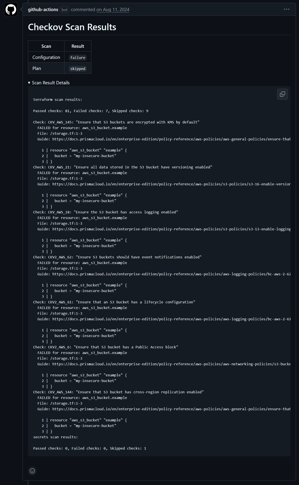

# Overview
This project explored security best practices for software development pipelines and cloud infrastructure. The objective was to explore and implement security controls throughout the software and infrastructure lifecycle. The cloud environment used to host the application was AWS and Elastic Kubernetes Service. The demo application hosted on the infrastructure is a simple Go API image.

3 individual repositories were used for the project:
- [application](/application/): A simple demo containerized API program written in Go. 
- [terraform](/terraform/): Infrastructure as Code (IaC) used to provision the cloud/Kubernetes environment for hosting the application.
- [gitops](/gitops/): Definitions for the operators/application inside the Kubernetes environment.

This project was an exploration of *some* of the security best practices in SDLC and cloud infrastructure. Security is an ongoing process of continuous improvement. There are security configurations/additions that I did not get a chance to implement or explore due to time limitations. This project was completed solo. The scope of the project was quite large. EKS security could have been a project on its own.

Below is a breakdown of the 3 repositories.

# Terraform Repository 
This repository contains the Terraform code and workflows used to manage and deploy all of the cloud infrastructure. 

## Code
Everything required to stand up the required infrastructure is defined within. Note that this repository did not follow a module/services pattern or require environment folders/branches because the scope of the project was limited to a single instance/environment/deployment.

The repository is configured to use a remote backend with state locking to prevent simultaneous changes to resources.

The code is broken into 2 folders:

### EKS
This folder contains the definitions for all of the resources needed for a fully operational EKS cluster to host the application:

- **EKS Cluster & Nodes:** The cluster itself. Deployed following [EKS Security Best Practices](https://docs.aws.amazon.com/eks/latest/best-practices/security.html) where possible.
- **VPC and Subnets:** Core network infrastructure required by EKS to deploy and run nodes. Includes private and public subnets, an internet gateway, and associated routes.
- **Security Groups:** Explicitly managed security groups following least-privilege principles. Includes dedicated security groups for the EKS control plane, worker nodes, and ALB. The default VPC security group is configured to deny all traffic. Security groups control cluster-to-node communication, node-to-node traffic, and external access through the load balancer.
- **AWS Load Balancer:** The AWS Load Balancer Controller, as well as the ingress definitions for both ArgoCD and the Go App. The controller is responsible for creating the corresponding ALB and routes for the ingress/services. The ArgoCD ingress allows team members to access the ArgoCD UI/API (restricted by IP). The Go API ingress allows public traffic to be routed to the application in the cluster. Both have Route53 domains and TLS certs.
- **Identities and Roles:** Manages the necessary roles and permissions for EKS. Includes Pod Identity/IRSA permissions for in-cluster operators like ESO and ALB.
- **External Secrets Operator**: This operator acts as a bridge between AWS Parameter Store (managed outside of Terraform) and the cluster. ESO pulls secrets from AWS Parameter Store and keeps the corresponding secret data synced inside the cluster. This allows secret values to be managed inside AWS rather than manually in the cluster. The cluster could therefore be seeded with the necessary secrets for bootstrapping without having to create them manually. ArgoCD required secrets from Parameter Store for bootstrapping. This required that ESO be managed through the Terraform repository rather than the GitOps repo. It is deployed in the cluster from a Helm chart using the Helm provider.
- **ArgoCD:** The ArgoCD operator is deployed into the cluster from a Helm chart. The app of apps reference to the GitOps repository is deployed alongside the operator. This allows the cluster to be bootstrapped without manual intervention.
- **WAF:** The WAF is associated with the ALB. It has the following rules associated with it:
  1.	*AWSManagedRulesCommonRuleSet:*	Blocks common web exploits (SQLi, XSS, bad bots, etc.)
  2.	*AWSManagedRulesLinuxRuleSet:*	Protects against Linux‑specific threats (Nodes & app are Linux-based)
  3.	*AWSManagedRulesKnownBadInputsRuleSet:*	Blocks known malicious payload patterns
  4.	*AWSManagedRulesAmazonIpReputationList:*	Blocks traffic from IPs with bad reputations
  The WAF also has a custom rate-limiting rule for DoS/Bot Traffic. Clients allowed to connect to the ArgoCD endpoint are also restricted by an IP whitelist.

### ECR
This folder contains the Terraform code for the container registry where Go Application images are pushed and signed by the build pipeline. I separated the ECR resources from the EKS resources in their own statefile/folder. This allowed me to delete the entire EKS cluster and associated resources without deleting the ECR instances. Deleting the ECR would have required me to rebuild/publish/sign the images each time I deleted the cluster. The EKS cluster pulls the images from this ECR.

## Workflows
There are two workflows in this repo: [terraform-merge](/terraform/.github/workflows/terraform-merge.yml) and [terraform-pr](/terraform/.github/workflows/terraform-pr.yml)

**Authentication**: Both of these workflows authenticate using OIDC. This means that no access keys are created or used to access the AWS account/service principal. Instead, the workflow authenticates using a token generated by the GitHub IDP. The AWS account has an OIDC provider configured for token.actions.githubusercontent.com to establish trust. This is a significant security win and removes the potential of access keys leaking.

### Terraform PR
This workflow runs Terraform plans to show the changes associated with the PR. It shows what changes would be made to the infrastructure if the PR were merged and the changes were applied. This means that team members would not have to authenticate from their local machines to plan changes.

Additionally, it also runs Checkov against the code and plan. Checkov scans infrastructure‑as‑code for security, compliance, and misconfiguration issues before deployment. This ensures that security vulnerabilities are identified and addressed before a PR is merged and resources are created/applied. Skips and risk acceptance of identified vulnerabilities are added to the resources as comments within the code. This ensures reasons are documented. Some findings on deployed resources have been risk accepted due to cost concerns.

Both the Terraform plan and Checkov results are commented on the PR. The following shows the comments on a PR with changes to add a new S3 Bucket with security vulnerabilities:

Plan Results          |  Checkov Security Scan Results
:-------------------------:|:-------------------------:
 | 

### Terraform Merge
This workflow only runs when changes in a PR are merged to main. Merging a PR to main is conditional on the PR having approvals and passing security/linting checks.

# Application Repository (Go App)
This repository contains the code and build pipelines for a simple web API written in Go. This is where developers would write/maintain/modify the code that the DevOps team then deploys and makes accessible to end users via the infrastructure.

## Code
This is an API for retrieving and managing world city time information stored in the container. 
It provides endpoints to:
  - Fetch the current local time for a specific city (/time/{city})
  - Fetch the current local time for all predefined cities (/time)
  - Add a new city and its time zone to the in‑memory list (/time/cities)
  - Remove an existing city from the list (/time/cities/{city})
The server uses the chi router with logging and panic‑recovery middleware. It stores city/time‑zone mappings in memory. There is no UI as it is an API. Time responses are returned in JSON. Time zone data is handled using Go’s built‑in time package and tzdata.

Go was selected because of the added security benefits. The same code was originally written in Python but had dozens of security vulnerabilities. This was primarily because of the number of vulnerabilities introduced by the required packages. Equivalent code in Go required only one third-party package, the remainder being native Go packages. These maintained much better security than the equivalent in Python.

This is a simple 'demo' application. The code/functionality was not the primary focus of this project.

## Workflows
This repository contains the workflows to perform security/quality checks and build/push resulting code versions for the Go code to a container registry. This functionality was broken into two pieces:

### PR Pipeline
This workflow performs automated security and code quality checks. It runs on pull requests to the main branch when files in the api/ directory change, or when manually triggered.

The workflow consists of three parallel jobs:
1. **Code Security Check** - Scans the Go code for vulnerabilities and security issues using two tools: Govulncheck (checks for known vulnerabilities in dependencies) and Gosec (analyzes code for security flaws). Results are posted as a comment on the PR.
2. **Image Security Check** - Builds a Docker image for the API and scans it for vulnerabilities using Grype. It fails the build if vulnerabilities of "low" severity or higher are found. Scan results are posted to the PR.
3. **Lint Check** - Runs golangci-lint to check code quality and enforce coding standards.

These checks ensure that security flaws are not introduced into the code base.

Code Security Results            |  Image Security Results
:-------------------------:|:-------------------------:
 | 

### Build Pipeline
This workflow automates the build, versioning, and deployment process for the code. It triggers when code changes are pushed/merged to the main branch.

The workflow has three sequential jobs:
1. **Increment Tag** - Automatically versions the release by fetching the last Git tag. It increments the minor version number (e.g., v1.5 → v1.6) by creating a new tag and pushing it to the repository. The new version is passed to subsequent jobs.
2. **Build/Push Image and Sign** - Builds an image using the code in the repository and pushes it to a private ECR (AWS Elastic Container Registry). It then cryptographically signs the image in the registry using AWS Signer and Notation for supply chain security and verification.
3. **Deploy** - Updates the image version defined in the deployment manifest contained in the GitOps repository to trigger a deployment of the newly created image version.

The Docker file in the Build Job leverages a two-stage build. Stage one is used to generate the executable. Stage two is used to copy and then run the produced executable in the final image. This allows for a smaller and stripped-down final image that contains only what is needed to run the code. The resulting image is more secure and has fewer potential attack surfaces. The base Go images are from Chainguard. These are hardened container images designed to be as small, secure, and transparent as possible.

This creates a fully automated CI/CD pipeline: code merge → version bump → build, push, & sign image → update deployment config → deployed into the cluster.

# GitOps Repository
This repository contains the definitions of all the Kubernetes resources required in the EKS cluster. It operates as a Git Operations repository. This means that git is the source of truth for the desired state of the resources in the cluster.

I opted to use ArgoCD. It is bootstrapped with a connection to this repository as part of the Terraform deployment. The following components are present inside this repo:

## App of Apps
The [apps](/gitops/apps/) folder contains ArgoCD Application manifests that follow the App of Apps pattern. Each manifest points ArgoCD at a corresponding folder in this repository (e.g., go-api, falco, kyverno). This pattern allows a single root Application deployed during Terraform bootstrapping to automatically discover and manage all other applications and their resources in the cluster.

## Falco
Falco is a runtime security engine for Kubernetes and Linux. It monitors system calls (syscalls) made by containers and nodes, then detects abnormal or risky behaviour such as:
- Opening a shell inside a running container
- Writing to sensitive directories
- Unexpected network connections
- Privilege escalation attempts

It can send alerts to a SIEM or messaging platform using falcosidekick if a potentially malicious syscall is detected. I configured alerts to be sent to a Slack channel. Falco takes time to tune for each Kubernetes cluster's operators/workloads. I created a simple detection rule for when a new shell process is created on a container as an example. I would like to explore Falco in more depth in the future.

## Kyverno
Kyverno is an admission controller that can be used to set restrictions or requirements on resources being deployed into the cluster. In essence, it is a policy engine for validating, mutating, and securing cluster resources. It allowed me to demonstrate the potential enforcement of resource and supply‑chain security. My Kyverno policies are not extensive due to time limitations. This example demonstrates its functionality by enforcing policies for a few sample resources. This deployment includes a small set of demo policies for Kyverno to enforce ([kyverno-policies](/gitops/kyverno-policies/)). 

The policies include:
- **[image-signature-check](gitops/kyverno-policies/image-signature-check.yml):** Validates the cryptographic signature on Go API images before they are pulled from the ECR using the Notation AWS Signer extension ([Kyverno Notation](/gitops/kyverno-notation)). This ensures that the image was not modified or replaced by an adversary.
- **[image-registry](gitops/kyverno-policies/image-registry.yml):** Restricts which container registries images can be pulled from. Only explicitly whitelisted registries (the project ECR, approved public registries for operators like Kyverno, ArgoCD, Falco, and ESO) are permitted. Images from unknown or unapproved registries are blocked.
- **[node-port](gitops/kyverno-policies/node-port.yml):** Restricts the creation of Services with type NodePort to prevent exposing host ports directly.

## Go API
Finally, this is the definition for the Go API software built in the [application repo](/application/). It includes a deployment and a simple service which the ALB routes traffic to. The user context is specified as non-root, and privilege escalation is disabled.

# Areas for Further Improvement
With additional time, I would have worked on the following areas:
- Creating a robust set of policies for both Falco and Kyverno
- Reviewing and further hardening network security controls (security groups, firewalls, WAF configuration)
- Implementing more EKS/Kubernetes security best practices (service accounts, namespace isolation, network policies)
- Service mesh for canary deployments and encrypted pod-to-pod communication
- Logging and monitoring for audit and security purposes within the cloud environment
